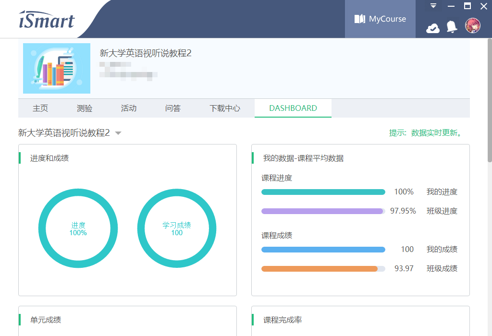
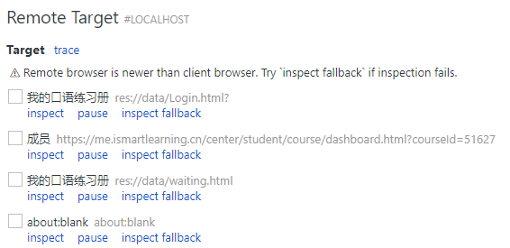
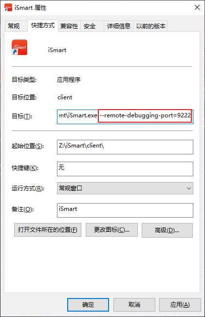
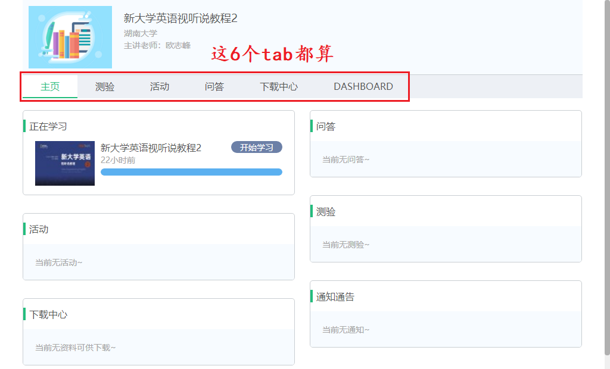

## iSmart 课程自动姬

### 效果展示

- 拥有更好的题型适应性，理论上适配所有客观题种类
- 提升稳定性，中途宕机概率大大降低

- 采用全新思路，相较 [自动化方案](https://github.com/Mufanc/iSmartAuto) ，效率提升超过 1000%



### 工作原理

&emsp;&emsp;使用抓包工具分析客户端流量，可以得知 iSmart 客户端采用的判题方式为本地评判。也就是说会首先将题目和答案一同下载下来，完成答题后使用用户的计算机完成判分，最后将分数回传。这样一来就为爬取答案提供了可能，脚本会根据提供的用户名和密码完成登录，然后将习题的答案下载下来，为进一步地自动答题做好准备。

&emsp;&emsp;一次偶然的机会，我发现 iSmart 客户端其实就是一个套壳的 Chromium，在其启动参数中加上 `--remote-debugging-port=9222` 参数后，其中页面便能够在 [chrome://inspect](chrome://inspect) 中被调试：



&emsp;&emsp;进而，可以通过 Python 调用 [Chrome DevTools Protocol](https://chromedevtools.github.io/devtools-protocol/) （cdp），完成答案的自动提交

#### Q&A

- **Q：** 既然是回传分数，那为何不用 Python 直接将分数上报，反而要走 cdp？

> &emsp;&emsp;上报分数的请求中有疑似 Hash 的字段 `ut`，且生成 `ut` 的方法 native，无法通过分析 JavaScript 得到（有木有大佬会 ollydbg 的来交个 PR）

<br/>

- **Q：** 使用这个脚本，会不会被检测到作弊？

> &emsp;&emsp;不排除这样的可能性，相较自动化而言，目前的方式提交的数据尚不完整（但成绩和学习时长会被记录），若是仔细比对，有可能会发现数据异常

### 使用方法

#### 下载源代码

&emsp;&emsp;在合适的位置打开终端，然后执行：

```shell
git clone https://github.com/Mufanc/iSmartAuto2.git
cd iSmartAuto2
```

&emsp;&emsp;如果你是直接下载的源码压缩包，那么直接在解压后的文件夹内打开终端

#### 安装依赖

&emsp;&emsp;在刚刚打开的终端中执行：

```shell
pip install -r requirements.txt
```

&emsp;&emsp;感谢 [@cyp0633](https://github.com/cyp0633) 的 [提醒](https://github.com/Mufanc/iSmartAuto2/pull/8)，现已将 `requirements.txt` 中的 websockets 版本降级为 8.1

#### 配置 iSmart 客户端

&emsp;&emsp;修改 iSmart 的启动快捷方式，增加参数 `--remote-debugging-port=9222`（如下图），**然后启动 iSmart 客户端并保持登录**



#### 配置运行参数

&emsp;&emsp;修改 `configs.yml` 中的账号和密码，保证与 iSmart 客户端中登录的账号一致，然后根据需要调整下方参数。在终端中执行 `py main.py -h` 可以查看更多帮助信息，这里列举几个常用命令

- 列出所有课程和书籍的详细信息

```shell
py main.py list -d
```

<br/>

- 根据书籍 id 执行刷课

```shell
py main.py flash -i 51627#7B6911511DB6B33638F6C58531D8FBD3
```

<br/>

- 根据当前打开的页面执行刷课

```shell
py main.py flash -c
```

注意如果打开的是「教材学习」页（如下图），只会刷打开的这一本书籍的任务


而如果是在课程详情页面，则会对该课程下的所有书籍执行刷课：



### 过滤器语法

- 待完善

### 常见问题

- 无法刷课？

&emsp;&emsp;**除非明确要求用户输入，本项目中的所有 Warning 都不会阻塞**，如果你莫名其妙卡住了，控制台又没有要求你输入，那么大概率是 未适配你的课程/环境没配置好/网络问题

- 父节点不存在？

&emsp;&emsp;不会因为报这个 Warning 而卡住，如果脚本运行完之后你发现所有任务点确实都刷到了，那么完全不用管这个 Warning

- 账号密码与登录不符？

&emsp;&emsp;脚本判断的逻辑比较粗糙，弹警告只是提醒你务必确保 iSmart 客户端和 `configs.yml` 中是同一个账号，确定无误后大胆使用即可

- **提 issue 前请看这个 ↓↓↓**

&emsp;&emsp;如果脚本出现异常，请检查你的课程和我学的是不是同一门（见上图），不同课程的参数可能会有细微差异，导致获取不到任务或者别的一些诡异现象。如果你有一定的爬虫开发经验，相信你自己可以通过该修改源代码很快解决这些问题；如果你只是想刷课，那么非常抱歉我并没有时间和精力去对每一本教材都做适配
